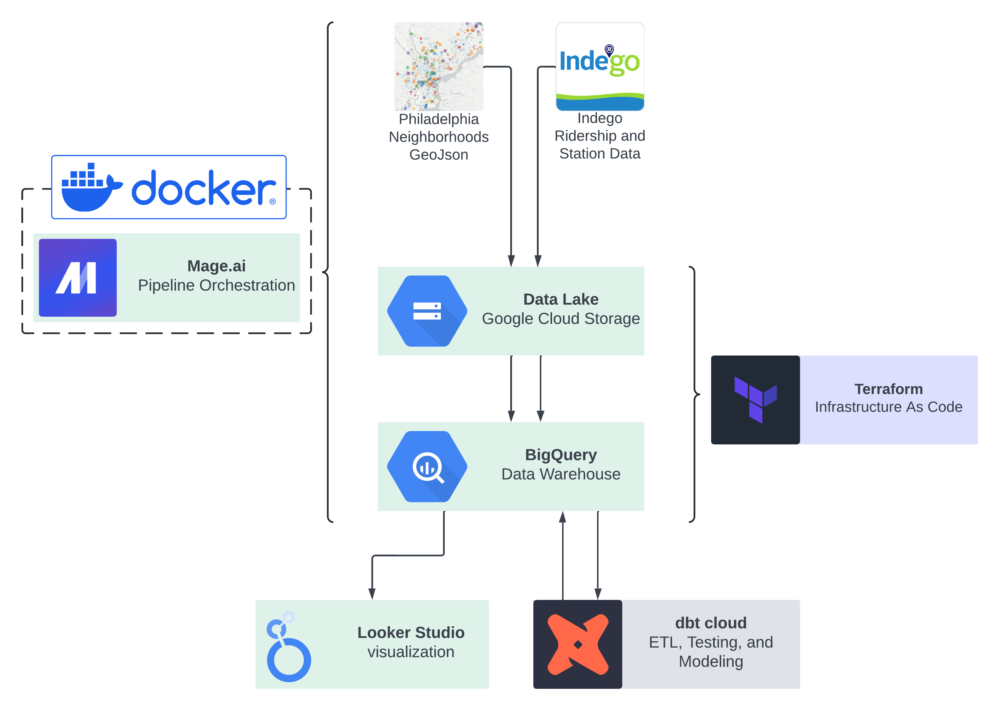
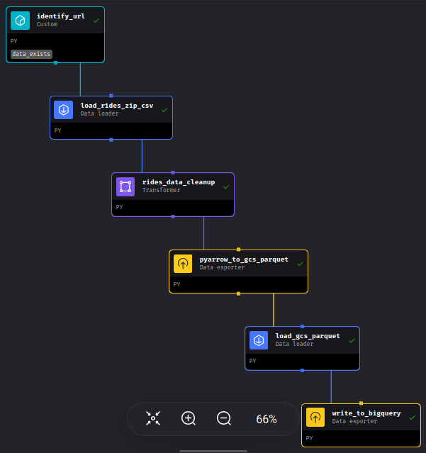
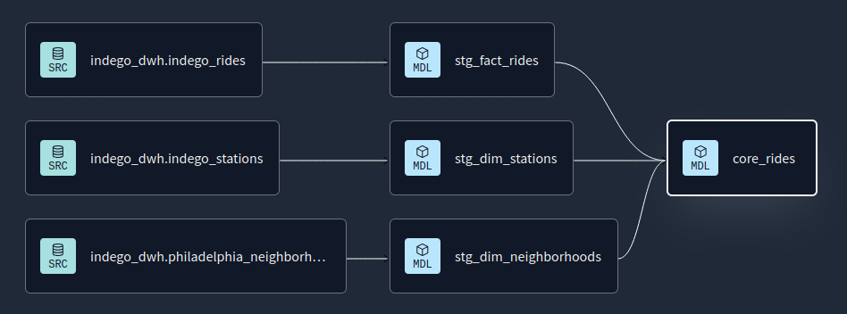
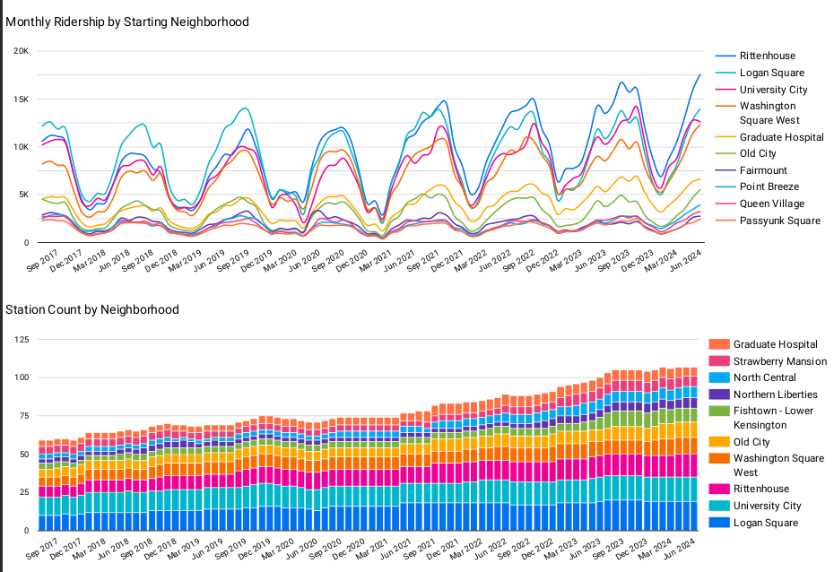
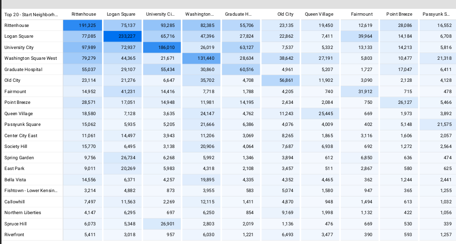
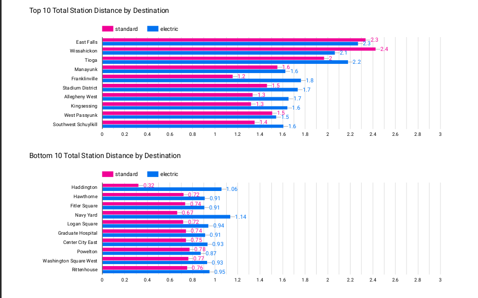

# Philadelphia Indego Bikeshare Data Pipeline

## Introduction
In this project, I use publicly available data and a mixture of cloud tools (GCP, dbt cloud) and open source tools (Terraform, Mage) to construct an automated end-to-end data pipeline for ridership records on Philadelphia's Indego bikeshare. This pipeline delivers cleaned, transformed data from multiple sources to a data warehouse, ready to connect with BI tools for analysis.

As a Philly resident who travels mostly by bike I am interested in bike infrastructure, culture, safety, and accessibility. This dataset allows us to see which neighborhoods have the most growth in traffic, the most stations available, and where electric assisted options have enabled riders to travel longer distances.

### Data sources
1. **Indego Bikeshare** [quarterly rides and station info](https://www.rideindego.com/about/data/)
 
 
Indego publishes anonymized records of all rides on their service quarterly as compressed CSV files. There is no published schedule and the filename format varies, which we address through strategic scheduling and webscraping. While there are new stations, only one station list CSV is available at a given time, with stations listed as Active or Inactive.

2. **OpenDataPhilly** [neighborhoods GeoJson](https://opendataphilly.org/datasets/philadelphia-neighborhoods/)
 
 
OpenDataPhilly is a compendium of data from various organizations, including the City of Philadelphia itself. They provide datasets for economics, public transit, crime, infrastucture, and much more. Thanks to Robert Cheetham for creating and maintaining the neighborhoods dataset.

### Pipeline and Orchestration
[Mage](mage.ai) is an open source orchestration tool which is developed and deployed in a containerized environment (in this case Docker).

Each of the 3 pipelines consist of reuseable code blocks assembled into a sequence, with built in testing and configurable variables - used in this case for BigQuery dataset names, data source urls, etc.

#### Rides Data Pipeline Example:
Conditional block "data_exists" checks if data for a given period is already in the Data Lake, and terminates the pipeline if so. Otherwise, our scraping block identifies the URL from Indego's page and passes it to the loader, which ingests the data from the CSV. Later blocks clean the data by fixing column names, validating values, dropping bad records, etc. before writing to cloud storage in partitioned parquet format and to bigquery as a dataset.

(diagram from the Mage ui)

### Modeling with dbt
In dbt cloud, I create a staging area for fact (rides) and dimension (stations and neighborhoods) tables, and a core directory housing a production dataset ready for analysis. For testing I used the classic packages dbt utils and dbt expectations. dbt projects are deployed to production on dbt cloud, which unfortunately doesn't get reflected in the code in this repository. Provisioning the dbt with Terraform and integrating it with Mage is a future stretch goal for this project.

### Visualization
Google's Looker Studio has built in integration with BigQuery. Examples of the visuals produced from this data model are below.

2017 Q3 - 2024 Q2

#### Monthly Ridership Trends
Clear seasonal trends with predictably soft ridership in the first year of the COVID pandemic  

#### Origin/Destination Neighborhood Heatmap
Showing the utility of the neighborhoods dataset

#### Top/Bottom 10 Destination Neighborhoods by Distance Traveled
Interestingly we don't see consistently longer rides on electric bikes in the longest rides.
Many of the top destinations

Some (like Franklinville) have
This is perhaps explained by 4 of the top 5 being destinations often reached via the very scenic and enjoyable Schuylkill river bike path.

### Reproducibility
Coming soon!

### Planned Future Updates
1. Provision dbt with Terraform and integrate with Mage: This would allow faster, fully automated deployment of the entire project
2. Streaming station data: Indego station capacity and bike availability is available in real time and could bring an entirely new level of detail to the project.
3. Incorporate transit data: To get a more complete picture of Philly's travel ecosystem. For example, it would be interesting to see how Indego ridership changes in areas with more or less public transit coverage.
4. More analytical tables: I kept the core models limited to a single because this was a short term project (for DataTalksClub's [Data Engineering Zoomcamp](https://github.com/DataTalksClub/data-engineering-zoomcamp))
